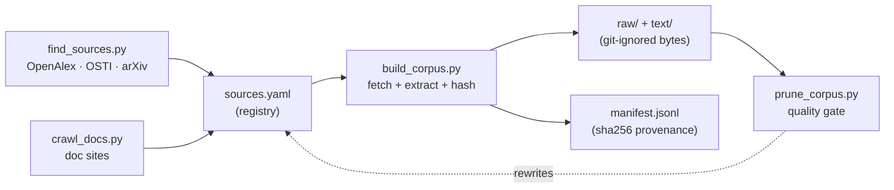

# nekaise-corpus

[](#license)
[](#licensing)
[](AGENTS.md)
[](https://github.com/OpenNekaise)

**An agent-operable recipe for assembling — and continuously growing — a building / HVAC /
building-energy corpus for LLM training & evaluation.**

The mission: find *all* the open building-energy knowledge on the internet and make it reproducibly
fetchable. This repo ships the **curation + loader + provenance** — **never the data bytes**. You
point your coding agent (Claude Code / Codex) at it; the agent fetches the seed corpus and discovers
more.

> **▶ Use it with your agent** — open this repo in Claude Code or Codex and say:
> - *"load the building-energy corpus"* → fetches every source into `raw/` + `text/`
> - *"find more building-energy sources and grow the corpus"* → discovers + adds new open sources
> - *"add the EnergyPlus docs"* → crawls a whole doc site into the registry
>
> The [`skills/`](skills/) drive each loop; [`AGENTS.md`](AGENTS.md) is the full operating manual.

## At a glance

| | |
|---|---|
| **Documents** | **1,707** |
| **Raw originals** | **~6.2 GB** (PDF / HTML) |
| **Extracted text** | **~153 MB** (~153.1M chars, **≈38.3M tokens**) |
| **Topics** | 5 |

**By genre** (the live partition from [`coverage.py`](coverage.py)): US gov / lab reports 955 ·
research papers 392 · practitioner Q&A (Unmet Hours) 177 · encyclopedic (Wikipedia) 97 ·
ontology / data-spec (Brick / Haystack / 223P) 39 · software / sim docs (VOLTTRON / Modelica) 29 ·
international bodies (IEA EBC) 8 · codes & standards 6 · industry / NGO 4. _Heavy on gov reports +
papers; codes, international, and datasets are the veins still being pumped._

**By topic:** equipment_systems 491 · controls_bas 373 · building_energy 317 · standards_protocols
281 · commissioning_fdd 245

**By source:** OSTI 877 · arXiv 211 · OpenAlex 179 · Unmet Hours 177 · Wikipedia 97 · PNNL 23 ·
VOLTTRON 21 · LBNL 20 · Brick 16 · Haystack 13 · open223 10 · etc.

**By license:** public-domain (US gov) 952 · open 443 · cc-by-sa 274 · cc-by 33 · proprietary-internal 5

_Snapshot of the current registry (2026-06-30). The bytes are not shipped — these are what you get
after running the loader. The corpus grows as sources are added to `sources.yaml`._

> This repo ships the **registry + loader + provenance**, NOT the data bytes. The corpus mixes
> licenses (US-gov public-domain, CC-BY-SA, arXiv, and some non-redistributable vendor/standards
> material), so we cannot and do not host the files. You fetch your own copy with the loader and
> respect each source's license. (This is how RedPajama / The Pile-style corpora work.)

## How it works



**discover → register → fetch → gate → repeat.** `find_sources.py` / `crawl_docs.py` propose new
entries for `sources.yaml`; `build_corpus.py` fetches each into `raw/` + `text/` and records its
sha256 in `manifest.jsonl`; `prune_corpus.py` drops the junk. Your agent runs this loop and keeps
widening it.

## What's here

| File | What it is |
|---|---|
| `sources.yaml` | The curated **registry** — each source's URL, topic, license, format. **Edit this to grow the corpus.** |
| `build_corpus.py` | The **loader** — downloads sources into `raw/`, extracts plain text into `text/`, dedups by sha256, writes the manifest. |
| `find_sources.py` | **Discovery** — queries OpenAlex / OSTI / arXiv for open-access sources (download-friendly hosts only) and proposes registry entries. |
| `crawl_docs.py` | **Discovery** — BFS-crawls a doc site (sphinx / readthedocs / mkdocs) and registers its pages, so multi-page references (not single PDFs) can be loaded. |
| `prune_corpus.py` | **Quality gate** — drops thin / garbage / non-English / off-topic discovered & crawled docs. |
| `manifest.jsonl` | **Provenance** — id, url, license, topic, sha256, bytes for every fetched doc. |
| `skills/` | The **skills** your agent runs — `load-corpus`, `find-sources`, `crawl-docs`. Exposed to Claude Code as pointer-stubs under `.claude/skills/` (the `skills/` files are the single source of truth). |
| [`AGENTS.md`](AGENTS.md) · [`CLAUDE.md`](CLAUDE.md) | The **operating manual** your coding agent reads first. |
| `raw/`, `text/` | **Git-ignored.** Your local copy of the bytes / extracted text. Never committed. |

## Use it

**Easiest — drive it with your agent.** Open the repo in Claude Code / Codex and ask it to *"load the
building-energy corpus"* or *"find more building-energy sources and grow the corpus."* The
[`load-corpus`](skills/load-corpus.md), [`find-sources`](skills/find-sources.md), and
[`crawl-docs`](skills/crawl-docs.md) skills drive each loop and verify the result.

**Or run it yourself:**

```bash
pip install -r requirements.txt
python build_corpus.py            # fetch missing sources (needs network)
python build_corpus.py --force    # re-fetch everything
python build_corpus.py --only controls_bas
python find_sources.py --per 20   # discover new sources to propose
```

## Reproducibility

A clone gets the **same corpus** we have. `manifest.jsonl` is the canonical record -- every doc's
`url` and **`sha256`**. When you run the loader it compares each download to the committed manifest
and reports `reproduced (sha256 match) / drifted (source changed upstream) / new`. To check an
already-downloaded copy without re-fetching:

```bash
python build_corpus.py --verify   # re-hash local raw/ files against the manifest sha256
```

- **Raw bytes** are the strong guarantee: sha256 is version-independent, so fetching the same URL
  yields a byte-identical file (or the run flags drift).
- **Extracted text** (`text/`) is derived via pypdf / beautifulsoup4 -- pin those
  (`requirements.txt`) for byte-identical text too.
- `sources.yaml` and `manifest.jsonl` are kept in sync; stable hosts (arXiv, `*.gov`) reproduce
  reliably, and any dead or changed source is reported, never silently dropped.

## Topics

`controls_bas` · `equipment_systems` · `building_energy` · `commissioning_fdd` · `standards_protocols`

The five tags are coarse on purpose — a source gets exactly one, chosen at registration. Coverage is
meant to keep growing, so treat the per-topic counts above as a moving snapshot, not a target.

## Licensing

**Read before you redistribute.** Every source carries a `license` in `sources.yaml` /
`manifest.jsonl`:

- **`public-domain`** — US government / national-lab reports (DOE, PNNL, LBNL, OSTI). Free to use.
- **`cc-by` / `cc-by-sa`** — Wikipedia and CC-licensed papers. Attribution (+ share-alike for `-sa`).
- **`open`** — arXiv / other OA papers. Check each paper's individual license; many are NOT freely
  redistributable.
- **`proprietary-internal`** — copyrighted vendor pages / standards (e.g. ASHRAE). Listed here as
  pointers for your own access only; **do NOT redistribute the bytes.**

`raw/` and `text/` are git-ignored for exactly this reason. What this project publishes is the
registry and manifest (pointers + metadata — our curation), plus the loader.

## Contributing

Add a source: append an entry to `sources.yaml` and open a PR. Prefer openly-licensed material
(public-domain gov reports, CC, arXiv). Keep copyrighted material `proprietary-internal` and never
add its bytes.

## License

The code, registry, and manifest in this repo are MIT. The referenced source documents retain their
own licenses (see above). Part of the [OpenNekaise](https://github.com/OpenNekaise) ecosystem;
consumed by [nekaise-studio](https://github.com/OpenNekaise/nekaise-studio) as domain-ceiling
material.
