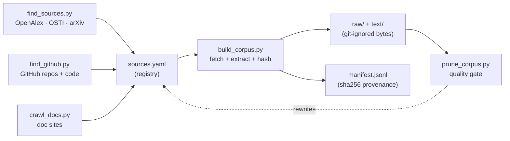

# nekaise-corpus

[](#license)
[](#licensing)
[](AGENTS.md)
[](https://github.com/OpenNekaise)

**An agent-operated, continuously growing corpus of open built-environment / AEC knowledge —
architecture, engineering & construction, structures, building energy & HVAC, materials,
infrastructure, urban systems — for LLM training & evaluation.**

This repo ships the **registry + loader + provenance — never the data bytes**. Every document is
indexed in `sources.yaml` with its URL, license, and sha256; you fetch your own copy with the
loader (the RedPajama / Pile model). A coding agent (Claude Code / Codex) is the intended operator:
it loads the corpus for you, then keeps discovering and adding new open sources.

## Quick start

Clone, open the repo in **Claude Code** or **Codex**, and say:

- **`go`** — loads every indexed source into `raw/` + `text/`; once caught up, offers a **daily
  growth job** (crontab, ≤3h/day) that keeps digging for new open data — commits locally, never pushes.
- **`dig`** — one growth round right now: discover new open sources → add → load → prune → local commit.
- *"add the EnergyPlus docs"* — crawls a whole documentation site into the registry.

Or run the machinery yourself:

```bash
pip install -r requirements.txt
python scripts/build_corpus.py            # fetch everything indexed (idempotent; --force, --only <topic>)
python scripts/find_sources.py --per 20   # discover new open-access papers/reports (OpenAlex/OSTI/arXiv)
python scripts/find_github.py             # discover docs + source code from curated AEC GitHub repos
python scripts/prune_corpus.py --apply    # quality-gate what came in
bash scripts/install_cron.sh              # optional: enable the daily growth job
```

## At a glance

<!-- STATS:START -->
| | |
|---|---|
| **Documents** | **9,333** |
| **Raw originals** | **~57G** (PDF / HTML / source code) |
| **Extracted text** | **~1.8G** (~1861M chars, **≈465M tokens**) |
| **Topics** | 11 |

**By topic** (a source gets one at registration): building_energy 4,084 · equipment_systems 1,544 · structures_civil 871 · controls_bas 600 · standards_protocols 451 · infrastructure 375 · commissioning_fdd 349 · construction 340 · architecture 310 · materials 267 · urban 142.

**By license:** open 2,522 · public-domain 5,105 · cc-by-sa 458 · cc-by 1,243 · proprietary-internal 5.

_Snapshot of the live registry (2026-07-07) — auto-generated from `manifest.jsonl`. The bytes are not
shipped; run the loader to fetch your own copy. The corpus grows as sources are added to `sources.yaml`._
<!-- STATS:END -->

**Where it comes from:** OSTI · arXiv · OpenAlex · OAPEN (CC-BY books) · **Internet Archive**
(pre-1929 public-domain engineering handbooks) · Wikipedia · Unmet Hours, dozens of curated
public-domain manuals (DOE · NIST · FHWA · FEMA · USGS · OSHA · GSA · NPS · HUD · USDA-FPL ·
WBDG UFC · NASA), and permissive GitHub repos including **source code** (Modelica `.mo` physics
models, structural/FEA `.py`).

## How it works



**discover → register → fetch → gate → repeat.** The discovery scripts propose entries for
`sources.yaml`; the loader fetches each into `raw/` + `text/` and records its sha256 in
`manifest.jsonl`; the pruner drops the junk. Your agent runs this loop and keeps widening it.

| Path | What it is |
|---|---|
| `sources.yaml` | The curated **registry** — each source's URL, topic, license, format. **Edit this to grow the corpus.** |
| `manifest.jsonl` | **Provenance** — id, url, license, topic, sha256, bytes for every fetched doc. |
| `scripts/` | The **machinery** — loader (`build_corpus.py`), discovery (`find_sources.py`, `find_github.py`, `find_osti.py`, `find_books.py`, `find_archive.py`, `crawl_docs.py`), quality gate (`prune_corpus.py`) + its `pruned_urls.txt` blocklist, cron runners. |
| `.claude/skills/` | The **playbooks** the agent follows — `go`, `load-corpus`, `find-sources`, `crawl-docs`, `dig`. |
| `workspace/` | The agent's **scratch space** (git-ignored) — one-off scripts stay out of the root. |
| [`AGENTS.md`](AGENTS.md) | The **operating manual** your coding agent reads first. |
| `raw/`, `text/` | **Git-ignored.** Your local copy of the bytes / extracted text. Never committed. |

## Proven useful

Training on this corpus measurably works: continued-pretraining **granite-4.1-3B** on the
building-energy core cut held-out domain **perplexity by 56%** (13.7 → 6.0) and flipped the model
from finding domain text *harder* than general text to finding it *easier* — across five models
(0.8B–14B, three families), with general knowledge preserved and a 3B model reaching ~86% of
Opus-4.8 on building-energy Q&A. Full method, honest caveats, and reproduction:
**[`RESULTS.md`](RESULTS.md)**.

## Reproducibility

A clone gets the **same corpus** we have. `manifest.jsonl` records every doc's `url` and `sha256`;
the loader compares each download against it and reports `reproduced / drifted / new`. Stable hosts
(arXiv, `*.gov`) reproduce reliably; any dead or changed source is reported, never silently dropped.
The raw bytes + sha256 are the reproducibility anchor; the extracted text in `text/` is derived and
can vary slightly across parser versions (pin exact versions in `requirements.txt` if you need
byte-identical text).

```bash
python scripts/build_corpus.py --verify   # re-hash local raw/ files against the manifest
```

## Licensing

Every source carries a `license` in `sources.yaml` / `manifest.jsonl` — **read it before you
redistribute anything**:

- **`public-domain`** — US government / national-lab work (DOE · NIST · FHWA · FEMA · …). Free to use.
- **`cc-by` / `cc-by-sa`** — Wikipedia, CC-licensed papers and books (OAPEN, IntechOpen, OpenStax).
  Attribution required (+ share-alike for `-sa`).
- **`open`** — arXiv / other OA papers. Check each paper's individual license; many are NOT freely
  redistributable.
- **`proprietary-internal`** — copyrighted vendor/standards material (e.g. ASHRAE). Pointers for
  your own access only; **never redistribute the bytes.**

`raw/` and `text/` are git-ignored for exactly this reason: this project publishes the registry,
manifest, and loader (our curation) — never the documents themselves.

## Contributing

Append an entry to `sources.yaml` and open a PR. Prefer openly-licensed material (public-domain gov
reports, CC, arXiv); tag copyrighted material `proprietary-internal` and never add its bytes.

## License

The code, registry, and manifest in this repo are MIT. The referenced source documents retain their
own licenses (see above). Part of the [OpenNekaise](https://github.com/OpenNekaise) ecosystem;
consumed by [nekaise-studio](https://github.com/OpenNekaise/nekaise-studio) as domain-ceiling
material.
