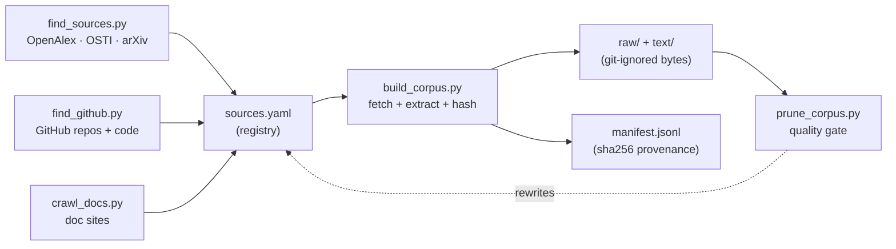

# nekaise-corpus

[](#license)
[](#licensing)
[](AGENTS.md)
[](https://github.com/OpenNekaise)

**An agent-operable recipe for assembling — and continuously growing — a built-environment / AEC
corpus (architecture, engineering & construction: structures, HVAC & building energy, materials,
construction, infrastructure) for LLM training & evaluation.**

The mission: find *all* the open **built-environment / AEC** knowledge on the internet — architecture,
engineering & construction, plus structures, bridges, geotechnical, building energy & HVAC, materials,
construction, fire, transportation, water, and urban systems — and make it reproducibly fetchable.
This repo ships the **curation + loader + provenance** — **never the data bytes**. You point your
coding agent (Claude Code / Codex) at it; the agent fetches the seed corpus and discovers more.
(Started as a building-energy corpus; scope widened to the whole built environment in round 7.)

> **▶ Use it with your agent** — clone, open the repo in Claude Code or Codex, and just say:
> - **`go`** → loads every indexed source into `raw/` + `text/`; once caught up, offers to turn on a
>   **daily job that keeps digging** for more open data (crontab, ≤3h/day, commits locally — never pushes)
> - *"find more built-environment sources and grow the corpus"* → discovers + adds new open sources
>   (papers/reports, **GitHub repos** — Modelica Buildings, EnergyPlus, PyPSA, structural/FEA/BIM libs —
>   **and their source code**, e.g. Modelica `.mo` physics models)
> - *"add the EnergyPlus docs"* → crawls a whole doc site into the registry
>
> The [`skills/`](skills/) drive each loop; [`AGENTS.md`](AGENTS.md) is the full operating manual.

## At a glance

<!-- STATS:START -->
| | |
|---|---|
| **Documents** | **6,634** |
| **Raw originals** | **~38G** (PDF / HTML / source code) |
| **Extracted text** | **~1.1G** (~1149M chars, **≈287M tokens**) |
| **Topics** | 11 |

**By topic** (a source gets one at registration): building_energy 2,044 · equipment_systems 1,406 · structures_civil 754 · controls_bas 599 · standards_protocols 447 · commissioning_fdd 346 · construction 250 · architecture 241 · infrastructure 238 · materials 201 · urban 108.

**By license:** open 2,495 · public-domain 2,817 · cc-by-sa 411 · cc-by 906 · proprietary-internal 5.

_Snapshot of the live registry (2026-07-03) — auto-generated from `manifest.jsonl`. The bytes are not
shipped; run the loader to fetch your own copy. The corpus grows as sources are added to `sources.yaml`._
<!-- STATS:END -->

**By source:** OSTI · arXiv · OpenAlex · Unmet Hours · **OAPEN** (CC-BY open-access books) · Wikipedia,
then dozens of curated public-domain manuals (FHWA · FEMA · NIST · USGS · OSHA · GSA · NPS · HUD ·
USDA-FPL · WBDG UFC · DOE / NASA / NBS) and permissive GitHub repos incl. **source code** — Modelica
`.mo` from modelica-buildings / IBPSA / IDEAS / AixLib / MSL, plus pvlib · PyPSA · VOLTTRON · sfepy ·
IfcOpenShell. _The first five topics are the building-energy core; the rest are the built-environment /
AEC veins._

> This repo ships the **registry + loader + provenance**, NOT the data bytes. The corpus mixes
> licenses (US-gov public-domain, CC-BY-SA, arXiv, and some non-redistributable vendor/standards
> material), so we cannot and do not host the files. You fetch your own copy with the loader and
> respect each source's license. (This is how RedPajama / The Pile-style corpora work.)

## Proven useful

Training on this corpus measurably works. _(Evidence below is from the building-energy core at the
round-6 snapshot — 1,707 docs / 38.3M tokens, before the round-7 built-environment expansion; a re-run
on the full 4,327-doc corpus is pending.)_ Continued-pretraining **granite-4.1-3B** on nekaise-corpus
cuts held-out **building-energy perplexity by 56%** (13.7 → 6.0) — and *specializes* the model: a base
model finds building-energy text *harder* than general text (13.7 vs 11.5); after CPT it finds it
**easier** (6.0 vs 7.2). **The effect holds across five models (0.8B–14B, three families)**, general knowledge is preserved
(domain quiz 0.975 → 0.975), and the corpus lifts the downstream building task (a 3B model reaches
~86% of Opus-4.8 on building-energy Q&A). Full method, honest caveats, and reproduction:
**[`RESULTS.md`](RESULTS.md)**.

## How it works



**discover → register → fetch → gate → repeat.** `find_sources.py` / `find_github.py` / `crawl_docs.py`
propose new entries for `sources.yaml`; `build_corpus.py` fetches each into `raw/` + `text/` and records
its sha256 in `manifest.jsonl`; `prune_corpus.py` drops the junk. Your agent runs this loop and keeps
widening it.

## What's here

| File | What it is |
|---|---|
| `sources.yaml` | The curated **registry** — each source's URL, topic, license, format. **Edit this to grow the corpus.** |
| `build_corpus.py` | The **loader** — downloads sources into `raw/`, extracts plain text into `text/`, dedups by sha256, writes the manifest. |
| `find_sources.py` | **Discovery** — queries OpenAlex / OSTI / arXiv for open-access sources (download-friendly hosts only) and proposes registry entries. |
| `find_github.py` | **Discovery** — walks a curated list (68) of permissive AEC / building-sim GitHub repos and registers their README / `docs/*.md` / `*.rst` — and, opt-in, **source code** (Modelica `.mo`, structural/FEA `.py`) via a `code:` field. Skips already-ingested repos to spread the 60/hr API budget across runs. |
| `crawl_docs.py` | **Discovery** — BFS-crawls a doc site (sphinx / readthedocs / mkdocs) and registers its pages, so multi-page references (not single PDFs) can be loaded. |
| `prune_corpus.py` | **Quality gate** — drops thin / garbage / non-English / off-topic discovered & crawled docs. |
| `manifest.jsonl` | **Provenance** — id, url, license, topic, sha256, bytes for every fetched doc. |
| `scripts/` | `dig.sh` (one headless growth round) + `install_cron.sh` (wire it to a daily crontab entry — commits locally, never pushes). |
| `skills/` | The **skills** your agent runs — `go`, `load-corpus`, `find-sources`, `crawl-docs`, `dig`. Exposed to Claude Code as pointer-stubs under `.claude/skills/` (the `skills/` files are the single source of truth). |
| [`AGENTS.md`](AGENTS.md) · [`CLAUDE.md`](CLAUDE.md) | The **operating manual** your coding agent reads first. |
| `raw/`, `text/` | **Git-ignored.** Your local copy of the bytes / extracted text. Never committed. |

## Use it

**Easiest — drive it with your agent.** Open the repo in Claude Code / Codex and ask it to *"load the
corpus"* or *"find more built-environment sources and grow the corpus"* (or just say *`go`* or *`dig`*).
The [`go`](skills/go.md), [`load-corpus`](skills/load-corpus.md), [`find-sources`](skills/find-sources.md),
[`crawl-docs`](skills/crawl-docs.md), and [`dig`](skills/dig.md) skills drive each loop and verify the result.

**Or run it yourself:**

```bash
pip install -r requirements.txt
python build_corpus.py            # fetch missing sources (needs network)
python build_corpus.py --force    # re-fetch everything
python build_corpus.py --only controls_bas
python find_sources.py --per 20   # discover new papers/reports to propose
python find_github.py             # discover README/docs + source code from curated AEC GitHub repos
bash scripts/install_cron.sh      # optional: enable the daily growth job (commits locally, never pushes)
```

## Reproducibility

A clone gets the **same corpus** we have. `manifest.jsonl` is the canonical record -- every doc's
`url` and **`sha256`**. When you run the loader it compares each download to the committed manifest
and reports `reproduced (sha256 match) / drifted (source changed upstream) / new`. To check an
already-downloaded copy without re-fetching:

```bash
python build_corpus.py --verify   # re-hash local raw/ files against the manifest sha256
```

- **Raw bytes** are the strong guarantee: sha256 is version-independent, so fetching the same URL
  yields a byte-identical file (or the run flags drift).
- **Extracted text** (`text/`) is derived via pypdf / beautifulsoup4 -- pin those
  (`requirements.txt`) for byte-identical text too.
- `sources.yaml` and `manifest.jsonl` are kept in sync; stable hosts (arXiv, `*.gov`) reproduce
  reliably, and any dead or changed source is reported, never silently dropped.

## Topics

Building-energy core: `controls_bas` · `equipment_systems` · `building_energy` · `commissioning_fdd` ·
`standards_protocols`
Built-environment / AEC (added round 7): `structures_civil` · `construction` · `materials` ·
`architecture` · `infrastructure` · `urban`

The tags are coarse on purpose — a source gets exactly one, chosen at registration. They're a coverage
radar, not a relevance gate (that's `prune_corpus.py`'s domain filter). Treat the per-topic counts
above as a moving snapshot, not a target.

## Licensing

**Read before you redistribute.** Every source carries a `license` in `sources.yaml` /
`manifest.jsonl`:

- **`public-domain`** — US government / national-lab work (DOE · PNNL · LBNL · ORNL · OSTI · NIST ·
  NASA · FHWA · FEMA · USGS · OSHA · GSA · NPS · HUD · USDA-FPL · WBDG UFC). Free to use.
- **`cc-by` / `cc-by-sa`** — Wikipedia, CC-licensed papers, open textbooks (OpenStax, Cleynen), and
  CC-BY books (OAPEN, IntechOpen). Attribution (+ share-alike for `-sa`).
- **`open`** — arXiv / other OA papers. Check each paper's individual license; many are NOT freely
  redistributable.
- **`proprietary-internal`** — copyrighted vendor pages / standards (e.g. ASHRAE). Listed here as
  pointers for your own access only; **do NOT redistribute the bytes.**

`raw/` and `text/` are git-ignored for exactly this reason. What this project publishes is the
registry and manifest (pointers + metadata — our curation), plus the loader.

## Contributing

Add a source: append an entry to `sources.yaml` and open a PR. Prefer openly-licensed material
(public-domain gov reports, CC, arXiv). Keep copyrighted material `proprietary-internal` and never
add its bytes.

## License

The code, registry, and manifest in this repo are MIT. The referenced source documents retain their
own licenses (see above). Part of the [OpenNekaise](https://github.com/OpenNekaise) ecosystem;
consumed by [nekaise-studio](https://github.com/OpenNekaise/nekaise-studio) as domain-ceiling
material.
