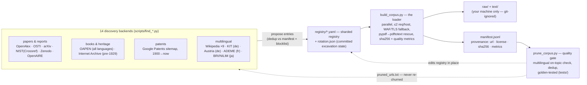

# nekaise-corpus

**An agent-operated, continuously growing corpus of open built-environment / AEC knowledge —
architecture, engineering & construction, structures, building energy & HVAC, materials,
infrastructure, urban systems — in every language — for LLM training & evaluation.**

> ### ⚠️ We do not redistribute the data
> The sources in this corpus carry many different licenses — US-government public domain, CC-BY,
> CC-BY-SA, open access with per-paper terms, and some copyrighted material we index as pointers
> only. Shipping the bytes would violate several of them, so **this repo never contains the
> documents themselves**. What it ships is the *recipe*: a *registry* of every source (URL, license,
> topic, sha256), a *loader* that fetches your own copy onto your own machine, and the *provenance*
> to verify it. This is the same model RedPajama and The Pile use. Every document's license is
> recorded per-source — respect it in whatever you do downstream.

## Use it

There are no commands to learn. Clone the repo, open it in **Claude Code** or **Codex**, and tell
the agent what you want — it reads [`AGENTS.md`](AGENTS.md) and the skills, and operates the corpus
for you:

- *“**Get me the corpus.**”* — the agent fetches every indexed source into `raw/` + `text/` on your
  machine, verifies the failures, and reports what you got. Once you're caught up it can enable a
  **daily growth job** (crontab, ≤3h/day) that keeps discovering new open data — committing locally,
  never pushing.
- *“**Find more sources and grow it.**”* — one growth round: the agent sweeps 14 discovery backends
  (papers, patents, books, multilingual repositories), judges relevance and license, loads what
  survives, and prunes the junk. The excavation state is committed (`registry/rotation.json`), so
  any agent on any machine resumes exactly where the last one stopped.
- *“**Add the EnergyPlus docs.**”* / *“重点挖一些中文的暖通资料”* — point it at anything specific:
  a doc site to crawl, a language to prioritize, a vein to dig deeper.

## At a glance

<!-- STATS:START -->
| | |
|---|---|
| **Documents** | **70,262** |
| **Raw originals** | **~215G** (PDF / HTML / source code) |
| **Extracted text** | **~9.5G** (~9.768B chars, **≈2.442B tokens**) |
| **Topics** | 11 |

**By topic** (a source gets one at registration): building_energy 26,358 · equipment_systems 14,938 · construction 9,566 · structures_civil 6,754 · materials 3,466 · infrastructure 2,557 · architecture 2,556 · standards_protocols 1,651 · controls_bas 1,171 · urban 876 · commissioning_fdd 369.

**By license:** open 21,579 · public-domain 39,057 · cc-by-sa 1,605 · cc-by 8,016 · proprietary-internal 5.

_Snapshot of the live registry (2026-07-19) — auto-generated from `manifest.jsonl`. The bytes are not
shipped; run the loader to fetch your own copy. The corpus grows as sources are added to the registry._
<!-- STATS:END -->

**Where it comes from:** US patents (Google Patents, public domain) · OSTI / NIST / NBS national-lab
reports · arXiv · OpenAlex · Zenodo · EU Horizon project deliverables (OpenAIRE) · OAPEN open-access
books (all languages) · Internet Archive pre-1929 engineering handbooks · Wikipedia in 9 languages ·
German building research (KIT, Austria's Stadt/Haus der Zukunft) · France's ADEME · Japan's BRI &
NILIM · dozens of curated public-domain manuals (DOE · FHWA · FEMA · USGS · OSHA · GSA · HUD ·
WBDG UFC · NASA) · permissive GitHub repos including **source code** (Modelica `.mo` physics models,
structural/FEA `.py`).

## How it works

**discover → register → fetch → gate → repeat.** The agent runs this loop and keeps widening it —
new backends are ~100-line scripts on top of the shared `registry.py`/`quality.py` machinery.

| Path | What it is |
|---|---|
| `registry/` | The **registry** — one YAML shard per vein (`curated.yaml` is the hand-picked seed; 15+ machine shards) + `rotation.json`, the committed excavation state that makes the growth loop resumable by anyone. |
| `manifest.jsonl` | **Provenance** — id, url, license, topic, sha256, bytes, quality metrics for every fetched doc. |
| `pruned_urls.txt` | **Blocklist** of everything the quality gate dropped — discovery never re-churns it. |
| `scripts/` | The **machinery** — the loader, 14 discovery backends, the quality gate, shared registry/quality libs, cron runners. |
| `.claude/skills/` | The **playbooks** the agent follows (`go` · `load-corpus` · `find-sources` · `crawl-docs` · `dig`). |
| `tests/` | **Golden tests** pinning the quality gate's verdicts per document class, wired to CI. |
| `workspace/` | The agent's **scratch space** (git-ignored). |
| [`AGENTS.md`](AGENTS.md) | The **operating manual** your coding agent reads first. |
| `raw/`, `text/` | **Git-ignored.** Your local copy of the bytes / extracted text. Never committed. |

## Reproducibility

A clone gets the **same corpus** we have. `manifest.jsonl` records every doc's `url` and `sha256`;
the loader compares each download against it and reports `reproduced / drifted / new`. Stable hosts
(arXiv, `*.gov`) reproduce reliably; any dead or changed source is reported, never silently dropped.
The raw bytes + sha256 are the reproducibility anchor; the extracted text in `text/` is derived and
can vary slightly across parser versions (pin exact versions in `requirements.txt` if you need
byte-identical text). Ask your agent to *"verify the corpus"* any time.

## Licensing

Every source carries a `license` in the registry / `manifest.jsonl` — **read it before you
redistribute anything**:

- **`public-domain`** — US government / national-lab work and expired-copyright texts (patents,
  DOE · NIST · FHWA · FEMA · pre-1929 books). Free to use.
- **`cc-by` / `cc-by-sa`** — Wikipedia, CC-licensed papers and books (OAPEN, IntechOpen, KIT).
  Attribution required (+ share-alike for `-sa`).
- **`open`** — arXiv / OA papers / government sites that allow downloading but not blanket
  redistribution. Check each source's individual terms.
- **`proprietary-internal`** — copyrighted vendor/standards material (e.g. ASHRAE). Pointers for
  your own access only; **never redistribute the bytes.**

`raw/` and `text/` are git-ignored for exactly this reason: this project publishes the registry,
manifest, and loader (our curation) — never the documents themselves.

## Contributing

Add an entry to `registry/curated.yaml` and open a PR — or clone it, tell your agent to dig a new
vein, and PR what it finds. Prefer openly-licensed material (public-domain gov reports, CC, arXiv);
tag copyrighted material `proprietary-internal` and never add its bytes.

## License

The code, registry, and manifest in this repo are MIT. The referenced source documents retain their
own licenses (see above). Part of the [OpenNekaise](https://github.com/OpenNekaise) ecosystem.
