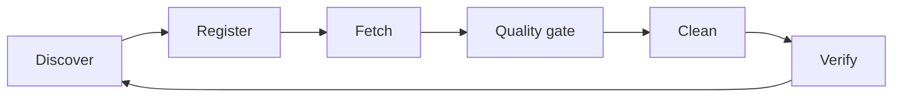

# nekaise-corpus

_An [OpenNekaise](https://github.com/OpenNekaise) project._

A continuously growing, multilingual corpus of open knowledge for architecture, engineering,
construction, and the systems that make cities work. It brings together structures, materials,
building energy, HVAC, transportation, water, fire, geotechnical engineering, and urban knowledge
for language-model training and evaluation.

Much of this knowledge is already public. It is simply scattered—across agencies, repositories,
patent offices, archives, and source trees. This project turns that fragmentation into one navigable,
auditable system.

It is not a data dump. It is a reproducible way to discover, fetch, verify, and refine open
knowledge—then continue from exactly where the last operator stopped.

> **This repository never redistributes source documents.**
>
> Every source keeps its own license. This repository contains the registry, provenance, and
> machinery needed to build your own local copy. The downloaded bytes remain on your machine.

## Begin with a sentence

Clone the repository, open it in Claude Code or Codex, and say what you want:

```bash
git clone --depth 1 https://github.com/OpenNekaise/nekaise-corpus.git
cd nekaise-corpus
```

- “Get me the corpus.”
- “Grow it with more open sources.”
- “Go deeper on Japanese structural engineering.”
- “Add the EnergyPlus documentation.”
- “Verify my local corpus.”

The agent reads [`AGENTS.md`](AGENTS.md), follows the repository playbooks, and runs the appropriate
workflow. You can operate the same machinery directly from the command line.

To build a local copy yourself:

```bash
pip install -r requirements.txt
python scripts/build_corpus.py
python scripts/clean_corpus.py
python scripts/clean_corpus.py --check
```

## The corpus, today

<!-- STATS:START -->
| | |
|---|---|
| **Documents** | **1,283,056** |
| **Policy-excluded provenance** | **8,039** rows (not fetched or training-ready) |
| **Raw originals** | **~696G** (PDF / HTML / source code) |
| **Extracted text** | **~69G** (~67.977B chars, **≈16.994B tokens**) |
| **Cleaned corpus** | **~66G** (~64.781B chars, **≈16.195B tokens**, ruleset-cleaned) |
| **Topics** | 11 |

**By topic** (a source gets one at registration): equipment_systems 426,364 · construction 327,460 · building_energy 181,000 · structures_civil 133,805 · materials 88,893 · infrastructure 58,778 · architecture 37,389 · standards_protocols 11,542 · controls_bas 10,990 · urban 6,005 · commissioning_fdd 830.

**By license:** open 1,027,300 · public-domain 235,320 · cc-by-sa 1,732 · cc-by 18,704.

_Snapshot of the eligible live registry (2026-09-11) — auto-generated from the manifest. Local raw/text
disk sizes may include retained policy-excluded cache; excluded bytes are not in `corpus/` and are
not fetched again. The bytes are not shipped; run the loader to fetch your own eligible copy._
<!-- STATS:END -->

The eligible corpus spans public institutions and national laboratories, open scholarship and
books, historical engineering archives, patents, multilingual repositories, documentation sites,
and permissively licensed technical source code. Its sources include Google Patents, OSTI, NIST,
NBS, arXiv, OpenAlex, Zenodo, OpenAIRE, OAPEN, the Internet Archive, SciELO, ADEME, GOV.UK, World
Bank, and the Modelica ecosystem. The provenance registry also retains reviewed policy exclusions,
including J-STAGE material, without presenting those bytes as training-ready.

## A corpus that remembers how it was made

Every document begins as a registered source and ends as verified, training-ready text. The path
between them is recorded.


```mermaid
flowchart LR
    D[Discover] --> R[Register]
    R --> F[Fetch]
    F --> G[Quality gate]
    G --> C[Clean]
    C --> V[Verify]
    V --> D
```

Discovery state lives in `registry/rotation.json`. Source metadata lives in `registry/`. Fetch
results and hashes live in `manifest/`. Reversible rights/policy exclusions live in
`registry/eligibility.json`; they preserve provenance while preventing future fetches and keeping
the affected text out of `corpus/`. Decisions made by the quality gate remain in
`registry/pruned-*.jsonl` and `pruned_urls.txt`. Another operator—or another machine—can resume the
same excavation without starting over.

The canonical round is deliberately fail-closed:

```bash
python scripts/run_round.py --commit
```

It runs discovery → fetch → prune → clean → check → statistics → index → lint → architecture
contracts → tests. A required failure advances nothing and creates no commit. A hard interruption
leaves a recoverable snapshot:

```bash
python scripts/run_round.py --recover latest
```

## Kept alive

Growth does not depend on one long-lived agent session. The deterministic dig runner wakes on a
schedule, advances the excavation state, validates the entire round, and commits only a healthy
snapshot. A separate maintainer can wake every six hours to look beyond the happy path.

```text
Settled snapshot → Codex triage → [Claude review for repairs/improvements] → locked action
```

Codex always moves first. A healthy pass can end without edits. Publication-only work skips the
second model; repairs and measured improvements receive a bounded Claude Opus 5 review (`xhigh`).
Claude gets the settled snapshot and proposal with tools disabled, so it challenges the reasoning
without duplicating repository exploration. Codex owns the final decision. Independent provider
cooldowns prevent repeated calls to exhausted accounts; Claude never replaces an unavailable Codex.

```bash
bash scripts/install_cron.sh
bash scripts/install_maintainer_cron.sh
```

Maintenance takes the scheduled-growth and canonical corpus-round locks for a settled snapshot,
releases them while models deliberate, then reacquires both and refreshes the snapshot before any
edits or publishing. Collection continues during read-only review. Active-round intermediate files
are never classified as corruption from an unlocked view. If an action leaves unsafe tracked state,
growth pauses explicitly until repaired. Timeout/cancellation stops the agent process group before
the action lock is released; the next pass can recover interrupted state.

Default budgets are 10 minutes for Codex triage, 5 for Claude review, and 30 for Codex action.
Override with `CODEX_TRIAGE_TIMEOUT`, `CLAUDE_REVIEW_TIMEOUT`, and `CODEX_ACTION_TIMEOUT` (seconds).
Codex uses its installed CLI model configuration. `CLAUDE_REVIEW_MODEL` and `CLAUDE_REVIEW_EFFORT`
override the reviewer; `MAINTAINER_LOCK_WAIT_SECONDS` bounds the combined wait for both locks
(default 11700 seconds). Set overrides in the scheduler environment to persist them. Logs record
lock wait/hold times, both snapshots and model results under `logs/maintainer-*`.

## Three views of every document

| Stage | Purpose |
|---|---|
| `raw/` | Original bytes. The reproducibility anchor. |
| `text/` | Verbatim extraction with provenance. Never cleaned in place. |
| `corpus/` | Cleaned, training-ready text derived from the manifest. |

All three directories are local and git-ignored. The repository never commits document bytes.
`corpus/` is built from eligible manifest rows rather than a directory listing, so unprovenanced or
policy-restricted files cannot silently enter a training run. Existing restricted `raw/` and
verbatim `text/` cache is retained for provenance and future rights review.

Cleaning is structural and language-safe. It removes repeated furniture, page markers, contents
leaders, OCR debris, patent identifier blocks, and similar artifacts without treating non-Latin
scripts or numeric engineering tables as noise. The active ruleset is recorded in
`corpus/.ruleset` and pinned by golden tests.

## Back up to an external SSD

Enable automatic backups with:

```bash
python scripts/backup_schedule.py install
python scripts/backup_schedule.py run
python scripts/backup_schedule.py status
```

The installer adds an hourly check at minute 15 to your existing crontab. It creates a new
verified backup when the latest completed copy is at least 24 hours old, waiting for the
corpus-round lock so growth and maintenance cannot overlap the copy. Missed runs catch up on
the next hourly check while the machine is on. The SSD is pinned by filesystem UUID; a missing
or different drive never causes a backup to be written into the local mount-point directory.

Scheduled runs keep the **seven newest successful backups**, deleting older copies only after
a replacement passes checksum verification. Abandoned `.partial` archives older than 48 hours
are cleaned under the same lock; unrelated files and symlinks are left alone. Copy/check failures
are logged and retried after six hours; an unavailable SSD is checked again hourly. Install with
`--interval-hours 24 --keep 7` to customize these defaults. Configuration and status live in
`workspace/backup-config.json` and `workspace/backup-status.json`; logs are in
`logs/backup-scheduled.log`.

For unattended remounting after reboot or reconnect, run this **one-time administrator step**
while the configured ext4 SSD is mounted:

```bash
sudo .venv/bin/python scripts/backup_schedule.py mount-setup
```

It preserves existing `/etc/fstab` entries and adds a UUID-pinned, `nofail,user` mount for this
SSD, allowing boot without the drive and later mounting without a password. It never formats
the drive. Without this step, unattended mounting depends on desktop permissions; if those
require authentication, mount the SSD manually and the next hourly check resumes backups.

Use `python scripts/backup_schedule.py run --force` for an immediate scheduled backup, or
`python scripts/backup_schedule.py remove` to remove only the backup cron entry. Existing
archives and the optional mount configuration remain.

For a manual backup without automatic retention:

```bash
python scripts/backup_corpus.py --dry-run
python scripts/backup_corpus.py --lock-timeout 10800
```

The default drive is `/media/zengp/ssd`; use `--mount /another/mounted/drive` to change it.
The command refuses an unmounted destination, waits up to the requested number of seconds for
the corpus-round lock, and runs the corpus consistency check before copying. Do not run standalone
loaders, pruners, or cleaners during a backup; scheduled rounds coordinate through the lock.

Each run creates a full, gzip-compressed `corpus.tar.gz` in a dated directory under
`/media/zengp/ssd/nekaise-corpus-backups/`. It includes `corpus/` with its `.ruleset`, `manifest/`,
`registry/`, `pruned_urls.txt`, and `requirements.lock`. Manual runs retain previous backups; each run
needs space for another full copy (the preflight conservatively budgets for uncompressed size).
`tar` and `gzip` are required; when installed, `pigz` speeds up compression using eight workers.
`raw/` and `text/` are not included.

The archive is flushed and read back to verify SHA-256 before the directory loses its `.partial`
suffix. A failed or interrupted backup remains `.partial` and must not be used as a complete copy;
rerunning creates a new backup. Completed backups include `SHA256SUMS` and `RESTORE.txt`.

From a completed backup directory, verify and restore into an empty destination:

```bash
sha256sum -c SHA256SUMS
mkdir -p /path/to/restored-corpus
tar -xzf corpus.tar.gz -C /path/to/restored-corpus
```

Review the restored eligibility policy against the current `registry/eligibility.json` before
using an older backup for training. Safely eject the SSD after the backup completes.

## Reproducible by design

The manifest records each source URL, license, byte count, SHA-256 hash, extraction metadata, and
quality metrics. On a later fetch, the loader reports whether the source was reproduced, changed,
or newly discovered. Nothing dead or different is silently ignored.

For a published dataset or evaluation, keep the manifest revision, `requirements.lock`, and the
cleaning ruleset together. They describe which bytes were fetched and how those bytes became the
text you used.

## What lives in this repository

| Path | Role |
|---|---|
| `registry/` | Source catalog, eligibility policy, backend configuration, rotation state, and prune decisions. |
| `manifest/` | Provenance and reproducibility record for every fetched document. |
| `scripts/` | Discovery, loading, extraction, quality, cleaning, verification, and automation. |
| `tests/` | Golden judgments for document quality and cleaning behavior. |
| `.claude/skills/` | Agent playbooks for loading, finding, crawling, cleaning, and digging. |
| `workspace/` | Rebuildable local indexes and agent scratch space. |
| [`AGENTS.md`](AGENTS.md) | The complete operating manual. |

The tracked YAML and JSONL files are authoritative. `workspace/corpus-index.sqlite3` is only an
acceleration layer; it can always be rebuilt.

## Licenses stay attached

“Open” is not one license. `nekaise-corpus` records the terms source by source:

- `public-domain` — US federal works and expired-copyright material.
- `cc-by` / `cc-by-sa` — reusable with attribution, and share-alike where applicable.
- `open` — available to fetch, but governed by the source's individual terms.
- `proprietary-internal` — a pointer for authorized access only. The bytes are never added.

Read the recorded license before redistributing or publishing derived material. This project publishes
the curation and the method, not a claim over the documents it references.

## Extend the map

Add a source to `registry/curated.yaml`, point an agent at a new collection, or build a discovery
backend for an untapped archive. Prefer public-domain and clearly licensed material. Every new vein
should be resumable, deduplicated, provenance-rich, and subject to the same quality gate.

Pull requests are welcome.

## License

The code, registry, and manifest are MIT licensed. Referenced documents retain their original
licenses. `nekaise-corpus` is one project in the wider
[OpenNekaise ecosystem](https://github.com/orgs/OpenNekaise/repositories).
