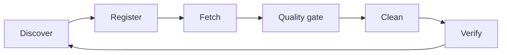

# nekaise-corpus

_An [OpenNekaise](https://github.com/OpenNekaise) project._

A continuously growing, multilingual corpus of open knowledge for architecture, engineering,
construction, and the systems that make cities work. It brings together structures, materials,
building energy, HVAC, transportation, water, fire, geotechnical engineering, and urban knowledge
for language-model training and evaluation.

Much of this knowledge is already public. It is simply scattered—across agencies, repositories,
patent offices, archives, and source trees. This project turns that fragmentation into one navigable,
auditable system.

It is not a data dump. It is a reproducible way to discover, fetch, verify, and refine open
knowledge—then continue from exactly where the last operator stopped.

> **This repository never redistributes source documents.**
>
> Every source keeps its own license. This repository contains the registry, provenance, and
> machinery needed to build your own local copy. The downloaded bytes remain on your machine.

## Begin with a sentence

Clone the repository, open it in Claude Code or Codex, and say what you want:

```bash
git clone --depth 1 https://github.com/OpenNekaise/nekaise-corpus.git
cd nekaise-corpus
```

- “Get me the corpus.”
- “Grow it with more open sources.”
- “Go deeper on Japanese structural engineering.”
- “Add the EnergyPlus documentation.”
- “Verify my local corpus.”

The agent reads [`AGENTS.md`](AGENTS.md), follows the repository playbooks, and runs the appropriate
workflow. You can operate the same machinery directly from the command line.

To build a local copy yourself:

```bash
pip install -r requirements.txt
python scripts/build_corpus.py
python scripts/clean_corpus.py
python scripts/clean_corpus.py --check
```

## The corpus, today

<!-- STATS:START -->
| | |
|---|---|
| **Documents** | **289,124** |
| **Policy-excluded provenance** | **402,758** rows (not fetched or training-ready) |
| **Raw originals** | **~583G** (PDF / HTML / source code) |
| **Extracted text** | **~46G** (~32.732B chars, **≈8.183B tokens**) |
| **Cleaned corpus** | **~31G** (~31.864B chars, **≈7.966B tokens**, ruleset-cleaned) |
| **Topics** | 11 |

**By topic** (a source gets one at registration): building_energy 85,804 · equipment_systems 71,041 · construction 49,773 · structures_civil 20,667 · materials 17,082 · architecture 12,310 · standards_protocols 11,509 · infrastructure 9,976 · urban 5,982 · controls_bas 4,149 · commissioning_fdd 831.

**By license:** open 88,715 · public-domain 180,497 · cc-by-sa 1,723 · cc-by 18,189.

_Snapshot of the eligible live registry (2026-08-27) — auto-generated from the manifest. Local raw/text
disk sizes may include retained policy-excluded cache; excluded bytes are not in `corpus/` and are
not fetched again. The bytes are not shipped; run the loader to fetch your own eligible copy._
<!-- STATS:END -->

The eligible corpus spans public institutions and national laboratories, open scholarship and
books, historical engineering archives, patents, multilingual repositories, documentation sites,
and permissively licensed technical source code. Its sources include Google Patents, OSTI, NIST,
NBS, arXiv, OpenAlex, Zenodo, OpenAIRE, OAPEN, the Internet Archive, SciELO, ADEME, GOV.UK, World
Bank, and the Modelica ecosystem. The provenance registry also retains reviewed policy exclusions,
including J-STAGE material, without presenting those bytes as training-ready.

## A corpus that remembers how it was made

Every document begins as a registered source and ends as verified, training-ready text. The path
between them is recorded.


```mermaid
flowchart LR
    D[Discover] --> R[Register]
    R --> F[Fetch]
    F --> G[Quality gate]
    G --> C[Clean]
    C --> V[Verify]
    V --> D
```

Discovery state lives in `registry/rotation.json`. Source metadata lives in `registry/`. Fetch
results and hashes live in `manifest/`. Reversible rights/policy exclusions live in
`registry/eligibility.json`; they preserve provenance while preventing future fetches and keeping
the affected text out of `corpus/`. Decisions made by the quality gate remain in
`registry/pruned.jsonl` and `pruned_urls.txt`. Another operator—or another machine—can resume the
same excavation without starting over.

The canonical round is deliberately fail-closed:

```bash
python scripts/run_round.py --commit
```

It runs discovery → fetch → prune → clean → check → statistics → index → lint → architecture
contracts → tests. A required failure advances nothing and creates no commit. A hard interruption
leaves a recoverable snapshot:

```bash
python scripts/run_round.py --recover latest
```

## Kept alive

Growth does not depend on one long-lived agent session. The deterministic dig runner wakes on a
schedule, advances the excavation state, validates the entire round, and commits only a healthy
snapshot. A separate maintainer can wake every six hours to look beyond the happy path.

```text
Codex inspects → Claude challenges → Codex decides, repairs, validates, and publishes
```

Codex always moves first. Claude Code is invited only when Codex finds concrete work: a failed or
stalled backend, interrupted state, unpublished growth, a coverage gap, or a worthwhile improvement
to the machinery. Claude remains a read-only second opinion; Codex owns the final action. Usage
limits defer that participant cleanly instead of stopping the corpus or repeatedly consuming a dead
quota window.

```bash
bash scripts/install_cron.sh
bash scripts/install_maintainer_cron.sh
```

The scheduled loops share an outer lock, and maintenance also takes the canonical corpus-round
lock used by every manual and automated entrypoint. Maintenance therefore begins between corpus
rounds. If a repair cannot leave the tracked repository safe, growth pauses explicitly for the
next maintainer wake rather than continuing over uncertain state.

## Three views of every document

| Stage | Purpose |
|---|---|
| `raw/` | Original bytes. The reproducibility anchor. |
| `text/` | Verbatim extraction with provenance. Never cleaned in place. |
| `corpus/` | Cleaned, training-ready text derived from the manifest. |

All three directories are local and git-ignored. The repository never commits document bytes.
`corpus/` is built from eligible manifest rows rather than a directory listing, so unprovenanced or
policy-restricted files cannot silently enter a training run. Existing restricted `raw/` and
verbatim `text/` cache is retained for provenance and future rights review.

Cleaning is structural and language-safe. It removes repeated furniture, page markers, contents
leaders, OCR debris, patent identifier blocks, and similar artifacts without treating non-Latin
scripts or numeric engineering tables as noise. The active ruleset is recorded in
`corpus/.ruleset` and pinned by golden tests.

## Reproducible by design

The manifest records each source URL, license, byte count, SHA-256 hash, extraction metadata, and
quality metrics. On a later fetch, the loader reports whether the source was reproduced, changed,
or newly discovered. Nothing dead or different is silently ignored.

For a published dataset or evaluation, keep the manifest revision, `requirements.lock`, and the
cleaning ruleset together. They describe which bytes were fetched and how those bytes became the
text you used.

## What lives in this repository

| Path | Role |
|---|---|
| `registry/` | Source catalog, eligibility policy, backend configuration, rotation state, and prune decisions. |
| `manifest/` | Provenance and reproducibility record for every fetched document. |
| `scripts/` | Discovery, loading, extraction, quality, cleaning, verification, and automation. |
| `tests/` | Golden judgments for document quality and cleaning behavior. |
| `.claude/skills/` | Agent playbooks for loading, finding, crawling, cleaning, and digging. |
| `workspace/` | Rebuildable local indexes and agent scratch space. |
| [`AGENTS.md`](AGENTS.md) | The complete operating manual. |

The tracked YAML and JSONL files are authoritative. `workspace/corpus-index.sqlite3` is only an
acceleration layer; it can always be rebuilt.

## Licenses stay attached

“Open” is not one license. `nekaise-corpus` records the terms source by source:

- `public-domain` — US federal works and expired-copyright material.
- `cc-by` / `cc-by-sa` — reusable with attribution, and share-alike where applicable.
- `open` — available to fetch, but governed by the source's individual terms.
- `proprietary-internal` — a pointer for authorized access only. The bytes are never added.

Read the recorded license before redistributing or publishing derived material. This project publishes
the curation and the method, not a claim over the documents it references.

## Extend the map

Add a source to `registry/curated.yaml`, point an agent at a new collection, or build a discovery
backend for an untapped archive. Prefer public-domain and clearly licensed material. Every new vein
should be resumable, deduplicated, provenance-rich, and subject to the same quality gate.

Pull requests are welcome.

## License

The code, registry, and manifest are MIT licensed. Referenced documents retain their original
licenses. `nekaise-corpus` is one project in the wider
[OpenNekaise ecosystem](https://github.com/orgs/OpenNekaise/repositories).
