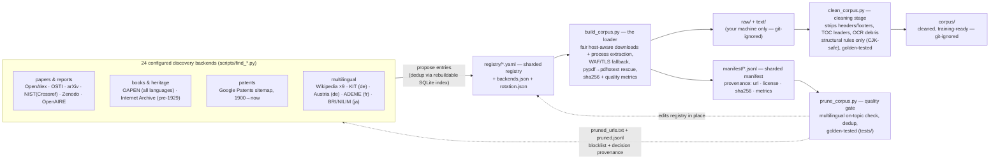

# nekaise-corpus

**An agent-operated, continuously growing corpus of open built-environment / AEC knowledge —
architecture, engineering & construction, structures, building energy & HVAC, materials,
infrastructure, urban systems — in every language — for LLM training & evaluation.**

> ### ⚠️ We do not redistribute the data
> The sources in this corpus carry many different licenses — US-government public domain, CC-BY,
> CC-BY-SA, open access with per-paper terms, and some copyrighted material we index as pointers
> only. Shipping the bytes would violate several of them, so **this repo never contains the
> documents themselves**. What it ships is the *recipe*: a *registry* of every source (URL, license,
> topic, sha256), a *loader* that fetches your own copy onto your own machine, and the *provenance*
> to verify it. This is the same model RedPajama and The Pile use. Every document's license is
> recorded per-source — respect it in whatever you do downstream.

## Use it

There are no commands to learn. Clone the repo, open it in **Claude Code** or **Codex**, and tell
the agent what you want — it reads [`AGENTS.md`](AGENTS.md) and the skills, and operates the corpus
for you:

- *“**Get me the corpus.**”* — the agent fetches every indexed source into `raw/` → `text/` →
  `corpus/` on your machine, verifies the failures, and reports what you got. Once you're caught up it
  can enable a **daily growth job** (crontab, ≤3h/day) that keeps discovering new open data —
  committing locally, never pushing.
- *“**Find more sources and grow it.**”* — one growth round: the agent sweeps 24 configured discovery
  backends, 20 currently enabled (papers, patents, books, multilingual repositories), loads what
  survives, and prunes the junk. The excavation state is committed (`registry/rotation.json`), so
  any agent on any machine resumes exactly where the last one stopped.
- *“**Add the EnergyPlus docs.**”* / *“重点挖一些中文的暖通资料”* — point it at anything specific:
  a doc site to crawl, a language to prioritize, a vein to dig deeper.

## At a glance

<!-- STATS:START -->
| | |
|---|---|
| **Documents** | **182,523** |
| **Raw originals** | **~361G** (PDF / HTML / source code) |
| **Extracted text** | **~19G** (~18.607B chars, **≈4.652B tokens**) |
| **Topics** | 11 |

**By topic** (a source gets one at registration): building_energy 52,901 · equipment_systems 43,257 · construction 32,565 · structures_civil 18,592 · materials 11,076 · infrastructure 7,806 · standards_protocols 5,588 · architecture 5,411 · urban 2,973 · controls_bas 1,981 · commissioning_fdd 373.

**By license:** open 87,513 · public-domain 67,537 · cc-by-sa 1,648 · cc-by 25,820 · proprietary-internal 5.

_Snapshot of the live registry (2026-08-02) — auto-generated from the manifest. The bytes are not
shipped; run the loader to fetch your own copy. The corpus grows as sources are added to the registry._
<!-- STATS:END -->

**Where it comes from:** US patents (Google Patents, public domain) · OSTI / NIST / NBS national-lab
reports · arXiv · OpenAlex · Zenodo · EU Horizon project deliverables (OpenAIRE) · OAPEN open-access
books (all languages) · Internet Archive pre-1929 engineering handbooks · Wikipedia in 9 languages ·
German building research (KIT, Austria's Stadt/Haus der Zukunft) · France's ADEME · Japan's BRI &
NILIM · dozens of curated public-domain manuals (DOE · FHWA · FEMA · USGS · OSHA · GSA · HUD ·
WBDG UFC · NASA) · permissive GitHub repos including **source code** (Modelica `.mo` physics models,
structural/FEA `.py`).

## How it works

```mermaid
flowchart LR
    subgraph FINDERS ["24 configured discovery backends (scripts/find_*.py)"]
        direction TB
        F1["papers & reports<br/>OpenAlex · OSTI · arXiv · NIST(Crossref) · Zenodo · OpenAIRE"]
        F2["books & heritage<br/>OAPEN (all languages) · Internet Archive (pre-1929)"]
        F3["patents<br/>Google Patents sitemap, 1900→now"]
        F4["multilingual<br/>Wikipedia ×9 · KIT (de) · Austria (de) · ADEME (fr) · BRI/NILIM (ja)"]
    end
    FINDERS -->|"propose entries<br/>(dedup via rebuildable SQLite index)"| R
    R["registry/*.yaml — sharded registry<br/>+ backends.json + rotation.json"]
    R --> B["build_corpus.py — the loader<br/>fair host-aware downloads + process extraction,<br/>WAF/TLS fallback, pypdf→pdftotext rescue,<br/>sha256 + quality metrics"]
    B --> D["raw/ + text/<br/>(your machine only — git-ignored)"]
    B --> M["manifest/*.jsonl — sharded manifest<br/>provenance: url · license · sha256 · metrics"]
    M --> P["prune_corpus.py — quality gate<br/>multilingual on-topic check, dedup,<br/>golden-tested (tests/)"]
    P -.->|"edits registry in place"| R
    P -.->|"pruned_urls.txt + pruned.jsonl<br/>blocklist + decision provenance"| FINDERS
    D --> C["clean_corpus.py — cleaning stage<br/>strips headers/footers, TOC leaders, OCR debris<br/>structural rules only (CJK-safe), golden-tested"]
    C --> O["corpus/<br/>cleaned, training-ready — git-ignored"]
```

**discover → register → fetch → gate → clean → repeat.** The agent runs this loop and keeps widening
it — new backends are ~100-line scripts on top of the shared `registry.py`/`quality.py` machinery.
The gate decides *which documents* survive; the cleaner decides *which lines within them* do.

| Path | What it is |
|---|---|
| `registry/` | The **registry** — one YAML shard per vein, `backends.json` control-plane config, `rotation.json` resumable excavation state, and the structured prune-decision ledger. |
| `manifest/` | **Provenance** — id, url, license, topic, sha256, bytes, quality metrics for every fetched doc; one `.jsonl` shard per vein (patents split by country) so no file nears GitHub push limits. |
| `pruned_urls.txt` | **Blocklist** of everything the quality gate dropped — discovery never re-churns it. |
| `scripts/` | The **machinery** — `run_round.py` is the fail-closed control plane; finders, loader, quality gate, cleaner, local SQLite index and cron runners sit behind it. |
| `.claude/skills/` | The **playbooks** the agent follows (`go` · `load-corpus` · `find-sources` · `crawl-docs` · `clean-corpus` · `dig`). |
| `tests/` | **Golden tests** pinning the quality gate's verdicts per document class and the cleaner's keep/drop rules, wired to CI. |
| `workspace/` | The agent's **scratch space** (git-ignored). |
| [`AGENTS.md`](AGENTS.md) | The **operating manual** your coding agent reads first. |
| `raw/`, `text/`, `corpus/` | **Git-ignored.** Your local copy in three stages: original bytes → verbatim extraction → cleaned, training-ready text. Never committed. |

## Reproducibility

A clone gets the **same corpus** we have (`git clone --depth 1` — history not needed). The manifest records every doc's `url` and `sha256`;
the loader compares each download against it and reports `reproduced / drifted / new`. Stable hosts
(arXiv, `*.gov`) reproduce reliably; any dead or changed source is reported, never silently dropped.
The raw bytes + sha256 are the reproducibility anchor; the extracted text in `text/` is derived and
can vary slightly across parser versions (use the exact versions in `requirements.lock` if you need
byte-identical text; install `requirements.lock` for the extraction versions used by this checkout).
Newly extracted rows record the extractor version and text hash. `corpus/` is derived again, from
`text/` plus the cleaning ruleset recorded in
`corpus/.ruleset` — quote that ruleset alongside the manifest if you publish results, since it is
part of what produced your training text. Ask your agent to *"verify the corpus"* any time.

## Reliable operation

`python scripts/run_round.py --commit` is the canonical autonomous round. It holds a repository
lock and runs discovery → fetch → prune → clean → check → README stats → index refresh → lint →
tests. Any non-zero required step prevents commit and push. `dig.sh` and `marathon.sh` are thin
wrappers around this same state machine; local run events are written under `logs/`. Normal failures
roll tracked state back. A hard kill leaves a snapshot recoverable with
`python scripts/run_round.py --recover latest`.

Discovery backends run concurrently, but never write shared YAML concurrently: each finder stages an
isolated JSON proposal, then the control plane deterministically deduplicates and merges successful
proposals before advancing rotation pointers. The loader separately schedules host-aware downloads
(`--workers`, default 16) and process-parallel extraction (`--extract-workers`, default ≤8), so slow
PDF parsing does not consume a network slot. Finder concurrency is configurable with
`run_round.py --discovery-workers N` (default 6).

The Git-tracked YAML/JSONL files remain the source of truth. `workspace/corpus-index.sqlite3` is a
git-ignored acceleration index, automatically invalidated by source-file signatures and safe to
delete or rebuild with `python scripts/corpus_index.py rebuild`.

## Licensing

Every source carries a `license` in the registry / manifest — **read it before you
redistribute anything**:

- **`public-domain`** — US government / national-lab work and expired-copyright texts (patents,
  DOE · NIST · FHWA · FEMA · pre-1929 books). Free to use.
- **`cc-by` / `cc-by-sa`** — Wikipedia, CC-licensed papers and books (OAPEN, IntechOpen, KIT).
  Attribution required (+ share-alike for `-sa`).
- **`open`** — arXiv / OA papers / government sites that allow downloading but not blanket
  redistribution. Check each source's individual terms.
- **`proprietary-internal`** — copyrighted vendor/standards material (e.g. ASHRAE). Pointers for
  your own access only; **never redistribute the bytes.**

`raw/`, `text/` and `corpus/` are git-ignored for exactly this reason: this project publishes the
registry, manifest, loader and cleaner (our curation) — never the documents themselves.

## Contributing

Add an entry to `registry/curated.yaml` and open a PR — or clone it, tell your agent to dig a new
vein, and PR what it finds. Prefer openly-licensed material (public-domain gov reports, CC, arXiv);
tag copyrighted material `proprietary-internal` and never add its bytes.

## License

The code, registry, and manifest in this repo are MIT. The referenced source documents retain their
own licenses (see above). Part of the [OpenNekaise](https://github.com/OpenNekaise) ecosystem.
